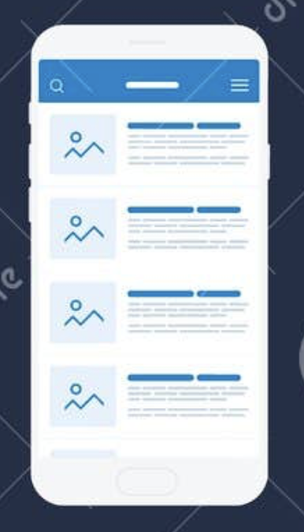
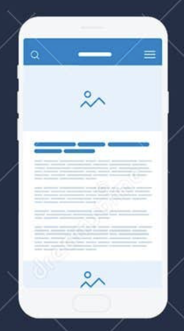

# Flutter House Project Logger App - Development Instructions

## Overview
Create a Flutter mobile application for logging house-related events, projects, and maintenance activities. The app should track information like fence installations, curtain purchases, renovation quotes, and other household project details with associated contacts and documents.

## App Structure Overview
The app has a simple structure with **list pages**, **single item pages**, **one creation page**, and **search functionality**:

1. **Create Project Page** - Single creation page for all content (projects, contacts, documents)
2. **Projects List Page** → **Single Project Page**
3. **Contacts List Page** → **Single Contact Page** 
4. **Documents List Page** → **Single Document Page**
5. **Search Page** - Universal search across all content

## Page-by-Page Implementation

### 1. Create Project Page (ONLY Creation Page)
**Route**: `/create-project`

**Purpose**: This is the ONLY page where new content can be created.

**Required Fields**:
- **Title** (Text input, required)
- **Description** (Multi-line text input, optional)
- **Add Contact** section:
  - Select from existing contacts OR add new contact
  - **New Contact Form**:
    - **First Name** (Text input, required)
    - **Last Name** (Text input, required)
    - **Company Name** (Text input, optional)
    - **Email** (Email input with validation, optional)
    - **Phone Number** (Phone input with formatting, optional)
    - **URL** (URL input with validation, optional)
- **Add Activities** section:
  - **Date** (Date picker)
  - **Activity** (Text input for activity description)
  - Add/remove multiple activities
- **Documents Upload** section:
  - File picker for multiple documents
  - Document preview before saving
  - Support for common file types (PDF, images, documents)
- **Tags** (Tag input field with autocomplete from existing tags)

**Functionality**:
- Form validation for required fields
- Save button to create project (saves project, contacts, documents, activities)
- Cancel button to return to projects list

### 2. Projects List Page → Single Project Page (MAIN LANDING PAGE)

**Route**: `/projects` (Main Home page - first page users see)

**Projects List Page** (Main Landing Page):
- **Top of screen**: "Create New Project" button prominently displayed
- **Main content**: List of all projects in card format (vertical scrollable list)
- Each project card displays:
  - Project title
  - Brief description (truncated)
  - Number of activities
  - Number of associated documents
  - Associated contacts (avatars or names)
  - Tags
  - Last activity date
- **Navigation**: Tap project card to view Single Project Page
- **Primary action**: "Create New Project" button at top leads to Create Project Page

**Single Project Page** (Project Details):

**Route**: `/project/:id`
- **Layout**: Full-screen project details with clean, focused design
- **Content sections**:
  - Large project title and complete description
  - All associated contacts (tappable to go to Single Contact Page)
  - All activities with dates in chronological order
  - All documents (tappable to go to Single Document Page)
  - All tags displayed as chips
  - Creation and last modified dates
- **Navigation**: Back button to return to Projects List Page

### 3. Contacts List Page → Single Contact Page
**Route**: `/contacts`

**Contacts List Page**:
- **Layout**: Card-based design with clean, modern UI
- **List format**: Vertical scrollable list of contact cards
- Each contact card displays:
  - **Left side**: Contact avatar/icon (circular icon with person/company symbol)
  - **Main content area**:
    - Full name (first name + last name) as primary text
    - Company name (if available) as secondary text
    - Star rating display (5-star system)
    - Price/rate information (if applicable)
  - **Right side**: Action button (e.g., "Buy" or contact button)
- **Visual design**: Cards with subtle shadows, clean typography, and consistent spacing
- **Interaction**: Tap anywhere on contact card to view Single Contact Page

**Single Contact Page**:
**Route**: `/contact/:id`
- Full contact details:
  - Complete name and company information
  - All contact methods (phone, email, URL)
  - List of projects this contact is associated with
  - Click-to-call phone numbers
  - Click-to-email email addresses  
  - Click-to-open URLs

**Note**: New contacts can only be added through the Create Project Page.

### 4. Documents List Page → Single Document Page
**Route**: `/documents`

**Documents List Page**:
- Grid or list view of all documents
- Each document item shows:
  - **Thumbnail** (generated preview or file type icon)
  - **Title** (document name or custom title)
  - File size and upload date
- Tap document to view Single Document Page

**Single Document Page**:
**Route**: `/document/:id`
- Full document view:
  - Large thumbnail/preview
  - Complete document details (title, size, upload date)
  - Associated project information
  - Document preview/viewer (for images, PDFs)
  - Share functionality
  - Delete functionality

**Note**: Documents can only be uploaded through the Create Project Page.

### 5. Search Page
**Route**: `/search`

**Search Interface**:
- **Search Bar** at top with placeholder text
- Search across ALL content:
  - Project titles and descriptions
  - Contact names and companies
  - Document titles
  - Activity descriptions
  - Tags
- Real-time search results as user types

**Results Display**:
- Categorized results sections:
  - **Projects** (tappable to Single Project Page)
  - **Contacts** (tappable to Single Contact Page)
  - **Documents** (tappable to Single Document Page)
  - **Activities** (shows activity with parent project link)
- "No results found" state
- Result count indicator

## Navigation Structure
- **Main Landing Page**: Projects List Page (first page users see when opening app)
- **Primary Action**: "Create New Project" button at top of Projects List Page
- Bottom navigation bar with:
  - Projects (main home tab - default selected)
  - Contacts
  - Documents
  - Search
- **Project Flow**:
  1. App opens → Projects List Page (main landing page)
  2. Tap "Create New Project" button → Create Project Page
  3. Tap any project card → Single Project Page
- Proper back navigation between list and single pages

## Technical Requirements

### Database Schema
Use SQLite with these tables:

**Projects Table**:
- id (primary key)
- title (text, required)
- description (text)
- created_date (datetime)
- updated_date (datetime)
- tags (text, comma-separated)

**Contacts Table**:
- id (primary key)
- first_name (text, required)
- last_name (text, required)
- company_name (text)
- email (text)
- phone_number (text)
- url (text)
- created_date (datetime)

**Activities Table**:
- id (primary key)
- project_id (foreign key)
- date (date)
- activity (text)
- created_date (datetime)

**Documents Table**:
- id (primary key)
- project_id (foreign key)
- title (text)
- file_path (text)
- file_size (integer)
- file_type (text)
- thumbnail_path (text)
- upload_date (datetime)

**Project_Contacts Table** (many-to-many):
- project_id (foreign key)
- contact_id (foreign key)

### Key Flutter Packages to Use
- `sqflite` - Local database
- `file_picker` - File selection
- `path_provider` - File system paths
- `shared_preferences` - Simple data storage
- `image` - Image processing for thumbnails
- `url_launcher` - Opening URLs/phone/email
- `flutter_tags` - Tag input functionality

### UI/UX Requirements
- Material Design 3 components
- Responsive design for different screen sizes
- Loading states for async operations
- Error handling with user-friendly messages
- Form validation with clear error messages
- Smooth transitions between list and single pages

## App Flow Summary
1. **Create**: Use Create Project Page to add projects, contacts, documents, activities
2. **Browse**: Use list pages to browse all content
3. **View Details**: Tap items to see single item pages with full details
4. **Search**: Use search to find any content across the entire app
5. **Navigate**: Use bottom navigation to switch between content types

Create a fully functional Flutter app following this simplified structure exactly as outlined.